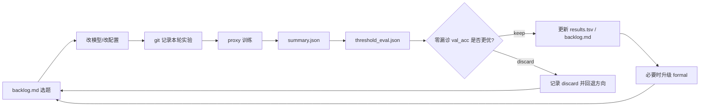

# 足踝 CT 机器学习判断有无病变项目总结（截至 2026-04-08）

> 基于以下项目事实整理：
> - `C:\Users\xxx\Desktop\足踝\backlog.md`
> - `C:\Users\xxx\Desktop\足踝\program.md`
> - `C:\Users\xxx\Desktop\足踝\results.tsv`
> - `C:\Users\xxx\Desktop\足踝\src\model.py`
> - `C:\Users\xxx\Desktop\足踝\src\dataset.py`
> - `C:\Users\xxx\Desktop\足踝\train.py`
> - `C:\Users\xxx\Desktop\足踝\tools\evaluate_threshold.py`
> - `C:\Users\xxx\Desktop\足踝\runs\autoresearch_proxy\summary.json`
> - `C:\Users\xxx\Desktop\足踝\runs\autoresearch_proxy\threshold_eval.json`
> - `C:\Users\xxx\Desktop\足踝\runs\autoresearch_formal\summary.json`
> - `C:\Users\xxx\Desktop\足踝\runs\autoresearch_formal\threshold_eval.json`

---

## 1. 项目流程与经历

### 1.1 项目目标

本项目的目标不是泛泛地做“CT 二分类准确率最大化”，而是更贴近临床安全目标：

**在验证集 FN=0（零漏诊）约束下，尽可能提高准确率与特异度。**

也就是说，项目从一开始就不是单纯追求 AUC，而是优先满足：

- **先不漏诊**（Sensitivity / Recall = 1.0 on validation）
- 再在这个前提下尽量减少误诊（提高 Specificity）
- 测试集只用于最终报告，不参与模型选择

这一定义直接决定了后续所有实验设计、阈值策略和模型选择逻辑。

---

### 1.2 整体研发流程

项目实际运行的是一个较完整的 autoresearch 闭环：

1. 阅读 `backlog.md`，确定当前最优结果与下一轮实验优先级
2. 根据 `program.md` 的约束修改模型/配置
3. 先跑 **proxy 实验**（4 epoch，快速筛选）
4. 读取 `summary.json`
5. 再跑 `evaluate_threshold.py`，得到 `threshold_eval.json`
6. 用“零漏诊阈值下的验证集准确率”判定 keep / discard
7. 把结果追加进 `results.tsv`
8. 把结论回写 `backlog.md`
9. 若 proxy 连续出现强结果，再升级到 **formal 实验**（15 epoch）

这个流程把“实验记录”“模型迭代”“阈值评估”“论文可追溯性”统一起来了。

---

### 1.3 项目演进主线（按阶段归纳）

| 阶段 | 主要内容 | 代表结果 | 结论 |
|---|---|---:|---|
| Baseline / Round 1 | 共享 backbone 的 Feature Fusion 起步 | formal AUC 0.940 | 能跑通流程，但上限有限 |
| Round 2 | 非共享 backbone 的 Feature Fusion 优化（augmentation、label smoothing 等） | Feature Fusion 最优 proxy 零漏诊 acc 0.777；formal 0.755 | 非共享 backbone 明显优于共享 |
| Round 3 | Decision Fusion 对比 | proxy 零漏诊 acc 0.787 | 决策融合开始超过特征融合 |
| Round 4-5 | VRG / ASF 探索 | VRG rerun 最佳 proxy 0.798；ASF 最佳 0.755 | “按样本动态分配视角权重”有潜力 |
| Stage 3 论文就绪验证 | Bootstrap、formal 对比、训练稳定化 | clipped VRG formal 零漏诊 acc **0.915** | 当前全局最优来自 Decision Fusion + 训练稳定化 |
| Stage 6-9 | UWDF / DGAF / PFDF / CVFI 等新结构探索 | 全部未超过主线最佳 | 复杂结构不一定优于简单稳健结构 |
| Stage 10 | Variance Reduction（冻结 backbone + LayerNorm） | freeze=3 proxy 零漏诊 acc **0.904** | 单次表现接近/达到 SOTA proxy，当前重点转向多 seed 稳定性验证 |

---

### 1.4 当前最重要的发展结论

1. **真正把结果拉高的不是“更复杂的结构”，而是“更稳的训练策略”。**
2. **非共享 backbone** 是项目中非常关键的结构性选择。
3. **Decision Fusion 路线整体优于 Feature Fusion / Attention Fusion。**
4. **gradient clipping** 是一个非常关键的收益点：它把 proxy 从 0.830/0.798 一路推进到 0.872，并最终带来 formal 0.915。
5. 当前进入 **Variance Reduction** 阶段，说明项目已从“提精度”进入“提稳定性、提论文可信度”的后期阶段。

---

## 2. 数据的流转过程图

### 2.1 数据流转图（从原始数据到论文指标）

```mermaid
flowchart TD
    A[原始足踝 CT 体数据<br/>NIfTI .nii.gz] --> B[metadata.csv<br/>patient_id / label / split / axial_dir / coronal_dir / sagittal_dir]
    B --> C{固定 split}
    C --> C1[Train 263]
    C --> C2[Val 94]
    C --> C3[Test 19]

    C1 --> D[PatientCTDataset]
    C2 --> D
    C3 --> D

    D --> E[按 axial / coronal / sagittal 三个解剖轴取切片]
    E --> F[每视角均匀采样 16 张切片<br/>trim_edge_slices = 1]
    F --> G[HU 窗裁剪 -1000~1000<br/>resize 到 192x192]
    G --> H[拼成张量<br/>shape = (B, 3, 16, 192, 192)]

    H --> I[ResNet18 多视角编码]
    I --> J[融合模块<br/>当前最佳为 Decision Fusion / VRG]
    J --> K[训练输出 best.pt]
    K --> L[summary.json<br/>AUC / F1 / accuracy / runtime]
    K --> M[threshold_eval.json<br/>零漏诊阈值与 no_miss 指标]
    M --> N[results.tsv]
    M --> O[backlog.md]
```

---

### 2.2 实验管理闭环图（autoresearch 工作流）



---

## 3. 各种重要数据，以及创新点

### 3.1 数据集关键统计

#### 3.1.1 样本量与划分

| 项目 | 数值 |
|---|---:|
| 总病例数 | 376 |
| 阴性（label=0） | 199 |
| 阳性（label=1） | 177 |
| train | 263 |
| val | 94 |
| test | 19 |

#### 3.1.2 各 split 的类别分布

| split | 阴性 | 阳性 |
|---|---:|---:|
| train | 139 | 124 |
| val | 50 | 44 |
| test | 10 | 9 |

#### 3.1.3 数据形式上的一个关键事实

当前 `metadata.csv` 中，**100% 的样本三列视角路径都指向同一个 NIfTI 体文件**。
这意味着本项目的“多视角”本质上是：

- 从**同一个 3D CT 体数据**中
- 沿三个不同解剖轴（axial/coronal/sagittal）抽取切片
- 构成一个 **2.5D multi-planar** 输入

这点非常重要，论文中应明确写成：

> 本研究不是三次独立采集的多视角检查，而是单次 CT 体数据的三平面重建/切片表示。

---

### 3.2 当前最佳模型配置（建议作为论文主方法）

来源：`C:\Users\xxx\Desktop\足踝\runs\autoresearch_formal\threshold_eval.json`

| 模块 | 当前最佳配置 |
|---|---|
| 输入几何 | 192 × 192 |
| 每视角切片数 | 16 |
| trim_edge_slices | 1 |
| 骨干网络 | ResNet18 |
| 视角策略 | 非共享 backbone (`share_backbone=false`) |
| 融合方式 | Decision Fusion（VRG 路线） |
| 预训练 | ImageNet pretrained |
| hidden dim | 256 |
| dropout | 0.3 |
| augmentation | 开启 |
| label smoothing | 0.0 |
| gradient clipping | 1.0 |
| formal 学习率 | 5e-5 |
| formal weight decay | 1e-4 |
| formal 训练 epoch | 15 |
| 零漏诊阈值 | **0.1729** |

---

### 3.3 当前最佳结果（最重要的一组表）

#### 3.3.1 formal 最优结果（全局最优）

| 指标 | 数值 |
|---|---:|
| 零漏诊 val_Acc | **0.9149** |
| 零漏诊 val_Specificity | **0.8400** |
| val_AUC | **0.9677** |
| 零漏诊阈值 | **0.1729** |
| Val 混淆矩阵 | TP=44, TN=42, FP=8, FN=0 |
| Test（固定验证阈值）Accuracy | 0.7368 |
| Test Specificity | 0.9000 |
| Test Sensitivity | 0.5556 |
| Test 混淆矩阵 | TP=5, TN=9, FP=1, FN=4 |

#### 3.3.2 对照：当前最优 proxy 结果（Variance Reduction）

| 指标 | 数值 |
|---|---:|
| 提交 | `f6f4ed8` |
| 零漏诊 val_Acc | **0.9043** |
| 零漏诊 val_Specificity | **0.8200** |
| val_AUC | **0.9682** |
| 配置 | freeze_layers=3 + LayerNorm + clipped VRG |

---

### 3.4 资源消耗与工程可复现性

| 运行类型 | 总时长 | 峰值显存 |
|---|---:|---:|
| proxy | 1827 s（约 30.5 分钟） | 824.6 MB（约 0.8 GB） |
| formal | 6055 s（约 100.9 分钟） | 1976.2 MB（约 1.9 GB） |

这说明当前方案在 **RTX 2070 SUPER 8GB** 上是可落地、可反复复现的，工程门槛不高。

---

### 3.5 整体实验账本统计

来源：`results.tsv`

| 项目 | 数值 |
|---|---:|
| 总实验条目 | 159 |
| proxy 实验 | 155 |
| formal 实验 | 4 |
| keep | 17 |
| discard | 142 |
| keep 占比 | 10.7% |
| crash 记录 | 0 |

这组数据很适合在论文方法学或补充材料中说明：

> 该模型并非偶然试出来，而是在一个连续、可回放的实验闭环中筛选出来的。

---

### 3.6 关键创新点：哪些真正有效，哪些值得当“负结果”写进论文

#### 3.6.1 已被证明“有效”的创新点

| 创新点 | 核心思想 | 结果判断 |
|---|---|---|
| **零漏诊阈值评估** | 先在验证集上找所有阳性样本的最小阳性概率作为阈值，再评估 acc/specificity | 是整个项目最核心的方法学创新之一 |
| **非共享 backbone** | 三个视角各用各自编码器，而非共享同一骨干 | 是明确有效的结构选择 |
| **VRG（View Reliability Gating）** | 让每个视角根据当前样本特征输出可信度，再动态加权融合 | 是当前主线方案的核心思想 |
| **Gradient Clipping** | 不改结构，只稳定训练动态 | 是把结果从 0.83/0.80 推到 0.872/0.915 的关键工程创新 |
| **Freeze + LayerNorm** | 通过冻结部分 backbone 与对视角头做 LayerNorm 来压 seed 方差 | 单次 proxy 已达 0.904，当前最值得继续深挖 |
| **Autoresearch 账本化实验管理** | backlog + program + results 的闭环管理 | 使实验轨迹可复盘、可写入方法学附录 |

#### 3.6.2 已经尝试，但暂未优于主线的创新点（很适合作为论文讨论/消融）

| 方向 | 设计思想 | 当前结论 |
|---|---|---|
| ASF（Asymmetric Safety-Biased Fusion） | 异常分支更偏“宁可误诊，不可漏诊” | 有启发，但未超过主线 |
| UWDF | 用不确定性加权不同视角 | 未优于主线 |
| DGAF | 同时做特征级 + 决策级双粒度融合 | 思路好，但未带来实质增益 |
| PFDF | 逐步蒸馏式融合多视角特征 | 未优于更简单方法 |
| CVFI | 显式加入跨视角二阶交互项 | 未优于主线 |
| Attention Pooling / Cross-View Attention | 用注意力替代均值池化并做视角交互 | 保留为可解释/扩展方向，但当前不是最优 |

**这其实是论文里非常有价值的一点：**

> 在小样本医学影像任务中，结构复杂度的增加并不天然带来收益；训练稳定化与目标函数/阈值定义往往比“更花哨的模块”更重要。

---

### 3.7 一个特别重要的“方差问题”

当前主线实验进入 Stage 10，原因不是“模型还不够高”，而是“模型还不够稳”。

根据 `backlog.md`：

- 同一主线模型在不同 seed 下曾出现：
  - seed=42 → 0.915（formal）
  - seed=123 → 0.787（proxy）
  - seed=456 → 0.521（proxy）
- 3-seed 标准差约 **0.19**

这对于论文是一个非常关键的问题：

- 单次最好成绩很好看
- 但如果跨 seed 波动过大，说明模型鲁棒性不足
- 所以 Stage 10 才引入 **freeze_layers + LayerNorm** 来降低 seed 方差

#### 参数规模与样本规模对比

以当前非共享 3 分支 Decision Fusion 为例：

| 设置 | 参数量 |
|---|---:|
| 总参数量 | 33,910,857 |
| freeze_layers=2 可训练参数 | 31,880,457 |
| freeze_layers=3 可训练参数 | 25,581,321 |
| 训练集样本数 | 263 |

这意味着：

- 全参数 / 样本 ≈ **12.89 万 : 1**
- freeze=2 可训练参数 / 样本 ≈ **12.12 万 : 1**
- freeze=3 可训练参数 / 样本 ≈ **9.73 万 : 1**

这也是为什么“方差缩减”在论文中不能写成小修小补，而应写成一个**核心可信度问题**。

---

## 4. 此外，一切值得写进论文讨论的内容

下面这些点都非常值得进入论文的 Discussion、Limitation、Ablation 或 Supplementary Material。

### 4.1 临床目标与机器学习目标不一致：本项目是“安全约束优化”，不是普通分类

本项目最值得写进论文的第一句话就是：

> 我们并不是以默认阈值下的 overall accuracy 为主目标，而是在 validation FN=0 的安全约束下，最大化准确率与特异度。

这使项目天然具有医疗场景意义，也与很多普通影像分类论文拉开差异。

---

### 4.2 零漏诊阈值的定义非常清楚，适合写进方法部分

可以直接写成：

\[
T_{no-miss} = \min\{p_i \mid y_i = 1,\; i \in Val\}
\]

即：

- 先收集验证集中所有阳性样本的预测正类概率
- 取其中最小值作为阈值
- 这个阈值保证验证集没有漏诊（FN=0）
- 再把该阈值应用到验证集/测试集做最终报告

这套定义具有很强的可复现性和临床解释性。

---

### 4.3 最好的验证集结果，并不意味着测试集已经“真正零漏诊”

这是全文必须诚实讨论的重点。

尽管 formal 最优模型在验证集达到：

- FN=0
- val acc = 0.915
- val specificity = 0.84

但在固定验证阈值下的测试集表现为：

- test sensitivity = 0.556
- test specificity = 0.900
- test FN = 4 / 9

也就是说：

> “验证集零漏诊阈值”并没有完全迁移成“测试集零漏诊”。

这恰好提示了临床模型最重要的问题之一：

- 阈值可迁移性有限
- 小样本下阈值校准不稳定
- 模型排序能力（AUC）和安全阈值泛化能力并不是一回事

这是一个非常值得展开讨论的医学 AI 现实问题。

---

### 4.4 当前最强提升来自训练稳定化，而不是更复杂的融合模块

这点很适合作为论文中“经验结论”：

- VRG 的方向是对的
- 但真正把它推进到 0.915 的关键，是 **gradient clipping + 合理学习率 + native geometry**
- 一系列复杂架构（UWDF、DGAF、PFDF、CVFI）都没有超越主线

这说明在本数据规模下：

> 稳定的优化过程，比更复杂的结构设计更重要。

---

### 4.5 192x16 明显优于 256x32，说明“更高分辨率/更多切片”不一定更好

项目已经实际验证过：

- formal native geometry（192x16）→ 成功达到 0.915
- formal geometry smoke（256x32）→ 明显退化到 0.691
- 后续 edge trimming / cosine 等修复只能部分回升，仍未回到主线高度

这很值得讨论：

1. 小样本下更大输入维度会放大过拟合
2. 更多切片可能引入更多无关背景
3. 真实有效的病灶信息未必需要更密的切片覆盖

这个结论对后续医学影像建模很有参考价值。

---

### 4.6 本项目的“多视角”其实是单 volume 三平面 2.5D 表示

这点要写清楚，否则读者容易误以为是三次独立采集。

建议论文中明确说：

- 输入来自单次 CT volume
- 分别沿 axial/coronal/sagittal 三个轴抽样
- 构造 2.5D 多平面输入
- 因而本研究更接近 **multi-planar reformatted classification**

这是医学影像领域中一个合理、轻量、可部署的折中方案。

---

### 4.7 样本量小、测试集更小，置信区间必须报告

根据项目记录，测试集仅 **19 例**，其中阳性 9 例、阴性 10 例。

这意味着：

- 单个病例就会显著改变 sensitivity / specificity
- 论文必须提供 Bootstrap CI，而不是只报单点指标

项目里已经做过 Bootstrap（1000 次重采样）的先行验证，得到例如：

- 验证集 no_miss acc 的 95% CI：**[0.766, 0.957]**
- 固定阈值测试集 acc 的 95% CI：**[0.526, 0.895]**
- 测试集 specificity 的 95% CI：**[0.667, 1.000]**

这说明当前结果虽然有亮点，但统计不确定性仍然较大。

---

### 4.8 当前 checkpoint 的 epoch 选择目标与项目总目标并不完全一致

这是一个很专业、很值得写进 limitation 的点。

当前 `train.py` 里：

- 训练过程中保存 `best.pt` 时，主要按 **AUC** 选 epoch
- 但实验间比较 keep/discard 时，主要按 **零漏诊阈值下的 val_acc** 选模型

这意味着项目实际上有两个层次的目标：

1. **run 内部**：best epoch by AUC
2. **run 外部**：best experiment by no-miss val_acc

这是一种合理工程折中，但也存在目标不完全对齐的问题。

未来可进一步研究：

- 是否可以直接按 no-miss val_acc 选 epoch
- 或构造面向“漏诊约束”的 differentiable surrogate objective

---

### 4.9 当前最需要补的，不是更多结构，而是更强的论文可信度验证

当前 unfinished 的最关键工作其实已经很清楚：

1. **multi-seed formal / proxy 验证**
2. **freeze=3 路线的方差量化**
3. **更系统的 Bootstrap / CI**
4. **最好增加 cross-validation 或外部验证集**

换句话说，项目接下来最该做的不是继续堆模块，而是：

> 把“这个结果是否稳定、是否可信、是否可复现”讲清楚。

---

### 4.10 很适合写进论文结论的一句话

如果要我用一句话概括这个项目最适合写成什么样的论文主线，我会建议：

> 在小样本足踝 CT 二分类任务中，相比更复杂的跨视角交互结构，面向临床零漏诊目标的阈值设计、非共享多视角决策融合以及训练稳定化策略，更能带来可复现的性能收益。

这句话基本概括了项目目前最有价值的“方法学故事”。

---

## 5. 建议作为论文主表/主图的内容

### 主表建议

1. **数据集统计表**：train/val/test、阳性/阴性数量
2. **三种融合模式主结果表**：Feature / Decision / Attention
3. **创新结构消融表**：VRG / ASF / UWDF / DGAF / PFDF / CVFI / Variance Reduction
4. **formal 最优结果表**：AUC、no-miss acc、specificity、threshold、test 指标
5. **多 seed 稳定性表**：mean ± std（当前最缺）
6. **Bootstrap CI 表**：val/test 关键指标置信区间

### 主图建议

1. **数据流转图**（本文件第 2 节可直接改）
2. **模型结构图**：三平面输入 + 3 分支编码 + 视角可靠度门控
3. **阈值评估示意图**：验证集阳性概率最小值如何定义 no-miss threshold
4. **实验路线图**：从 baseline → Decision Fusion → VRG → clipped VRG → Variance Reduction

---

## 6. 当前项目状态一句话总结

**这个项目已经从“能跑通的足踝 CT baseline”发展成了一个以“零漏诊”为核心目标、具备完整实验账本和论文雏形的医学影像研究项目；当前最佳 formal 结果为验证集零漏诊准确率 0.915，但下一阶段的核心任务已经不再是盲目提点数，而是证明该结果在不同 seed、不同评估重采样和更严格验证下依然成立。**
